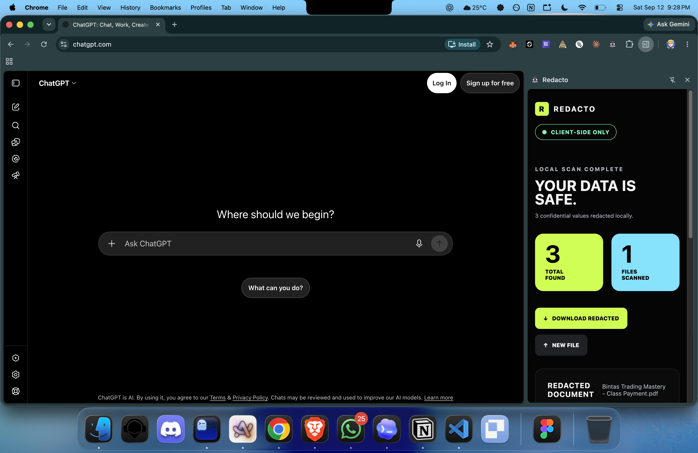

# Redacto

Redacto finds private information in text before you share it with an AI tool.

It works on your device. It replaces things like email addresses, phone numbers, card numbers, and access keys with clear markers. You can review the result, copy it, and paste it into any AI tool yourself.



## What It Does

- Scans text files, PDFs, and Excel files.
- Finds common private information locally.
- Shows the number of private values found in each file.
- Shows a redacted preview without destroying the original file.
- Creates downloadable redacted copies for review.
- Skips banking, health, email, government, document editor, and code sites by default.
- Includes readable fonts, contrast, spacing, focus, and speech settings.

## Privacy

Redacto does not send your page text anywhere. It has no account, API key, tracking, or automatic upload.

Detection is deterministic and conservative. No automated detector can identify every confidential value, so review the redacted text before sharing it.

## Install

1. Run `npm install`.
2. Run `npm run build`.
3. Open `chrome://extensions/`.
4. Enable Developer mode.
5. Choose Load unpacked and select `dist/`.

Redacto does not require a model download or a network connection.

## Development

```bash
npm run build
npm run lint
npm test
npm run typecheck
npm run format
```

## For Developers

- `files.*`: the Chrome side panel and file scanning workspace.
- `background.js` and `content.js`: connect the side panel to the current page.
- `lib/redactor.js`: local detection rules.
- `lib/chunker.js`: chooses readable page text.
- `lib/renderer.js`: redaction and restore behavior.
- `lib/settings.js`: saved preferences and site exclusions.

## Checks

The automated checks cover confidential-data detection, page selection, sanitization, and saved settings.

## Known Limitations

- Restore state is in-memory for the current page session.
- Detection is deterministic and conservative; it cannot identify every confidential value.
- Always review the redacted text before sharing it with an LLM.
- Browser speech uses the local browser speech engine and is capped to the first 4000 characters.

## Release

1. Update version in `manifest.json` and `package.json`.
2. Run `npm run lint`, `npm test`, `npm run typecheck`, and `npm run build`.
3. Load `dist/` manually and complete smoke tests.
4. Package the contents of `dist/`.

## Roadmap

- Add Playwright E2E tests with fixture pages.
- Add richer readable-content scoring for complex app layouts.
- Add per-site profile presets.
- Add stronger dynamic-page restore reconciliation.
- Add packaged release signing notes.
